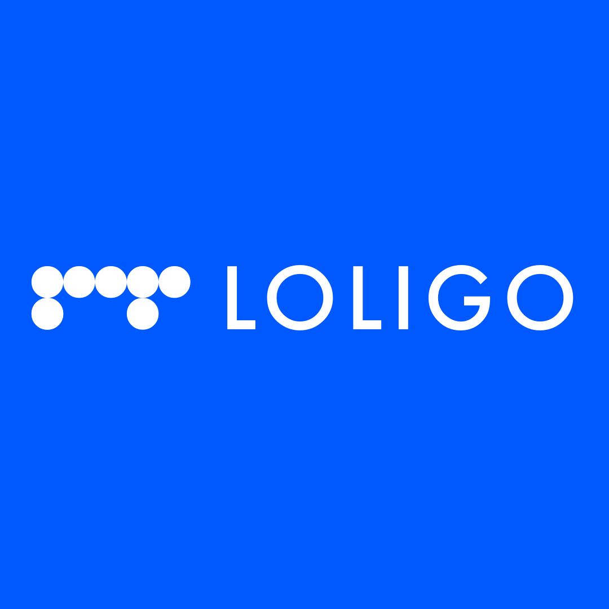

# Inkflow API — Challenge Loligo

<p align="center">
  
</p>

<p align="center">
  API conversacional en Python con memoria por <code>conversation_id</code>,<br/>
  <code>agent_loop</code> explícito (LangChain) y tools sobre Yahoo Finance.
</p>

<p align="center">
  Entrega para proceso senior en <strong>Loligo</strong>.
</p>

---

## Requisitos del challenge

| Requisito | Implementación |
|-----------|----------------|
| Agente conversacional con memoria por `id` | `app/memory/store.py` + Postgres opcional |
| Tool de Yahoo Finance | `app/agent/tools.py` → `app/services/yahoo.py` |
| LangChain | `bind_tools` + mensajes en `app/agent/loop.py` |
| `agent_loop` explícito | `app/agent/loop.py` |
| `POST /chat` | Envía mensaje, ejecuta agente, persiste turno |
| `GET /chat/{id}` | Devuelve historial de la conversación |

## Stack

- FastAPI, Pydantic v2, LangChain, yfinance
- Memoria: in-memory (dev) o PostgreSQL vía `DATABASE_URL`
- Tests: pytest (26 tests)

## Estructura relevante

```
app/
  agent/loop.py      # agent_loop — orquestación LLM + tools
  agent/tools.py     # get_market_data, get_ticker_news, scan_market_setups
  api/chat.py        # endpoints /chat
  memory/            # store + postgres
  services/yahoo.py  # quote, history, snapshot
```

## Endpoints

| Método | Ruta | Descripción |
|--------|------|-------------|
| `POST` | `/chat` | `{ id, message, lang }` → reply + tool_calls |
| `GET` | `/chat/{conversation_id}` | Historial completo |
| `GET` | `/chat` | Listado de conversaciones |
| `GET` | `/health` | Liveness |
| `GET` | `/metrics` | Contadores básicos |

## Producción (extras implementados)

- Validación de config en `APP_ENV=prod` (API key, DB, CORS)
- Rate limiting en `/chat` (IP + conversation_id)
- Timeouts y retries en llamadas a LLM y Yahoo
- `Idempotency-Key` opcional en `/chat`
- Persistencia de mensajes `tool` en el historial

## Ejecución local

```bash
python -m venv .venv
.venv\Scripts\activate
pip install -r requirements.txt
cp .env.example .env   # configurar LLM_API_KEY
uvicorn app.main:app --reload --port 8000
```

## Tests

```bash
python -m pytest -q
```

## Variables de entorno

Ver `.env.example`. Principales:

```bash
LLM_API_KEY=
DATABASE_URL=          # vacío = memoria in-process
CORS_ALLOW_ORIGINS=*
APP_ENV=dev            # prod exige key, DB y CORS explícito
```

## Enlaces

- Repositorio: [TheNasky/Loligo-Backend-Challenge](https://github.com/TheNasky/Loligo-Backend-Challenge)
- Deploy: [Docs](https://battery-single-mask-proceed.trycloudflare.com/docs)
- Frontend (proyecto aparte): [TheNasky/Inkflow-Frontend](https://github.com/TheNasky/Inkflow-Frontend)
- Deploy Front: [inkflow-loligo.vercel.app](https://battery-single-mask-proceed.trycloudflare.com/docs)
